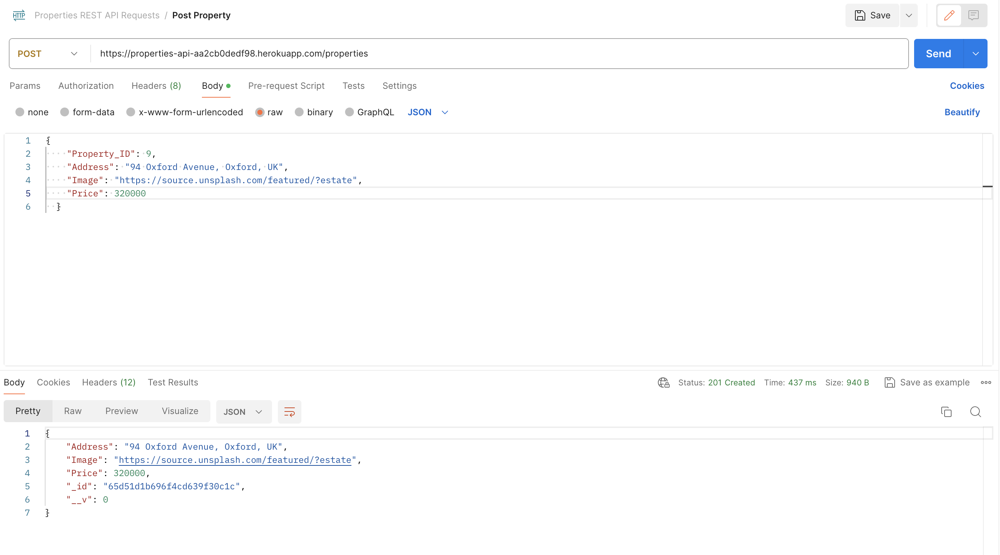

# properties_api

This REST API allows users to view property listings that are currently for sale and also to add a new listing to the list.

## Technologies

This REST API is built with Node.js and Express.js, and the business logic is modelled with Mongoose. The API is hosted on Heroku (https://properties-api-aa2cb0dedf98.herokuapp.com/properties), and the database is built using MongoDB and is hosted on MongoDB Atlas. The API endpoints have been tested with Postman.

- Node.js
- Express.js
- Mongoose
- Heroku
- MongoDB Atlas
- Postman

## API Endpoints

<table>
	<thead>
    <tr>
      <th>Business Logic</th>
      <th>URL</th>
      <th>HTTP Method</th>
			<th>Request Body Format</th>
			<th>Response Body Format</th>
    </tr>
  </thead>
	<tbody>
		<tr>
			<td>Return a list of properties</td>
			<td>/properties</td>
			<td>GET</td>
			<td>None</td>
			<td>Returns an array of JSON objects with the following structure:
			{
				"Address": "18 Liverpool Avenue, Liverpool, UK",
				"Image": "https://source.unsplash.com/featured/?apartment",
				"Price": 600000
			}
			</td>
    </tr>
		<tr>
			<td>Add a new property</td>
			<td>/properties</td>
			<td>POST</td>
			<td>JSON object with the following structure:
			{
				"Address": "18 Liverpool Avenue, Liverpool, UK",
				"Image": "https://source.unsplash.com/featured/?apartment",
				"Price": 600000
			}
			</td>
			<td>A verification message that returns added JSON object and 201 status code is request is successful or an error message is request failed. </td>
    </tr>
	</tbody>
</table>

## Testing with Postman

